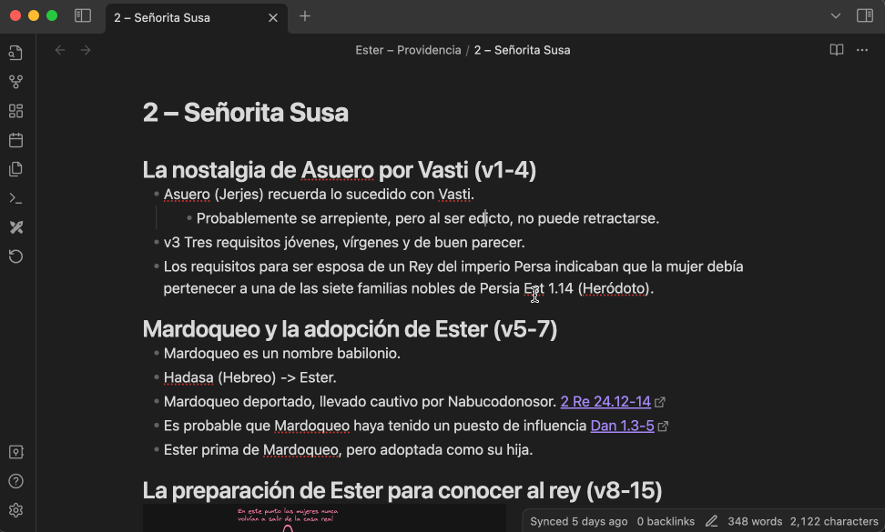

# 📖 Link to Verse Plugin for Obsidian

Easily create links to Bible passages in your Obsidian notes using any online Bible tool.

## ✨ Features

- 🔗 **Quick Links**: Instantly generate links to Bible passages.
- 📖 **Easy Reference**: Input Bible references in a natural format (e.g., John 3:16).

## 🛠 Installation

### From Obsidian Plugin Marketplace

1. Open Obsidian.
2. Navigate to `Settings` > `Community plugins`.
3. Click on `Browse` and search for `Link to Verse`.
4. Click `Install` and then `Enable`.

### Manual Installation

1. Download the latest release from the [Releases](https://github.com/aygjiay/obsidian-link-to-verse/releases) page.
2. Extract the contents of the zip file to your Obsidian plugins folder: `<vault>/.obsidian/plugins/obsidian-link-to-verse`.
3. Enable the plugin in Obsidian via `Settings` > `Community plugins`.

## 🚀 Usage

1. Open any Markdown note in Obsidian.
2. Select a Bible reference (e.g., `John 3:16`) from your note.
3. Press `Ctrl+P` (or `Cmd+P` on Mac) to open the command palette.
4. Type `Create link to Bible` and select the command.
5. Your Bible reference will be replaced by a link to the passage in your note.

## ⚙️ Configuration

You can configure the plugin settings to fit your preferences:

### Default Version

Specify your preferred default Bible version.

- **Example**: `NLT` (New Living Translation)

### Link Template

Define the template for the URL linking to the Bible passage. The template should include a `{{verse}}` placeholder and optionally a `{{version}}` placeholder.

- **Example**: `https://www.biblegateway.com/passage/?search={{verse}}&version={{version}}`

### Setting Configuration

1. Go to `Settings` > `Community plugins` > `Link to Verse` > `Options`.
2. Enter your preferred Bible language (used to recognize book names and some abbreviations) (currently supported: `sp`, `en`).
3. Enter your preferred default Bible version (e.g., `NLT`).
4. Enable the use of `+` instead of URL-encoded spaces.
5. Set the link template to your desired format (e.g., `https://www.biblegateway.com/passage/?search={{verse}}&version={{version}}`).

#### Supported Tokens in Link Template

Currently, two Templates are supported:

1. **Default** template supports tokens:

  - `verse` (Required): Contains the full Bible reference, including book, chapter, and verse or range of verses.
  - `version` (Optional): Contains the Bible version. If included but missing in the selected reference, the default version set in the plugin configuration will be used.

2. **Olive Tree** template supports tokens:

  - `book` (Required): Contains the book name of the Bible reference.
  - `chapter` (Required): Contains the chapter number.
  - `verse` (Required): Contains the verse number.

**Link to Verse** detects the template based on the tokens used. If your template includes `book`, `chapter`, and `verse`, it is identified as an **Olive Tree** template; otherwise, it defaults to the **Default** template.

## 📚 Examples

### BibleGateway Support

Input: `John 3:16`

With the `NLT` version and the link template `https://www.biblegateway.com/passage/?search={{verse}}&version={{version}}`:

Output: `[John 3:16](https://www.biblegateway.com/passage/?search=John+3:16&version=NLT)`

### Olive Tree URL Support

Input: `1 Timothy 3:16`

Since Olive Tree does not support Bible translations, it is ignored. Use the link template `olivetree://bible/{{book}}.{{chapter}}.{{verse}}`:

Output: `[1 Timothy 3:16](olivetree://bible/1%20Timothy.3.16)`

## 🛡️ License

This project is licensed under the MIT License. See the [LICENSE](LICENSE) file for details.

## 🤝 Contributing

Contributions, issues, and feature requests are welcome! Feel free to check the [issues page](https://github.com/aygjiay/obsidian-link-to-verse/issues) if you want to contribute.

## 🙏 Acknowledgements

- [Obsidian](https://obsidian.md) for the excellent markdown-based knowledge management tool.
- [BibleGateway](https://www.biblegateway.com) for providing a great and free online Bible tool.

## 📬 Contact

Feel free to reach out with any questions or suggestions:

- **Email**: aygjiay@gmail.com

---

> "Your word is a lamp to my feet and a light to my path." - Psalm 119:105
